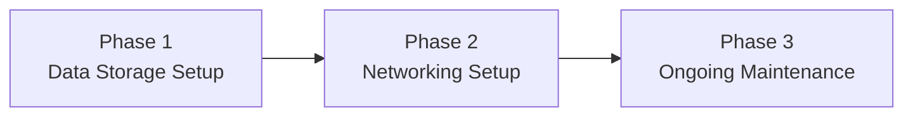

---
{"dg-publish":true,"permalink":"/1-get-started/1-2-pricing-and-timeline/"}
---

# Pricing

**STARTER TIER**: Give your business a **robust data storage scheme with basic remote access**. Use a real workflow rather than just what's been available to you.

**PRO TIER**: Elevate your setup with **tailored and customizable data and networking solutions**, built with your needs in mind. See how your workflow can adapt to your needs, and not the other way around.

|             | STARTER             | PRO                 |
| ----------- | ------------------- | ------------------- |
| Setup       | $1,000 one-time fee | $2,500 one-time fee |
| Maintenance | $1,500 per year     | $5,000 per year     |

---
# Timeline

---

## Phase 1: Set up data storage scheme

> [!info] Essential Data Handling Solutions (*Starter* and *Pro* tiers)
> - Set up **network-attached storage device (NAS)**
> - Build **a resilient (yet effortless) backup system** using the [[x. Knowledge Base/What is a 3-2-1 backup strategy?\|3-2-1 Backup Strategy]]
> - Check out what else we can do [[x. Knowledge Base/Solution Examples\|here]]

> [!done] Custom Data Handling Solutions (*Pro* tier only)
> 
> - Solutions that are tailored to your specific workflow, and not just designed for the general public
> - “customized file sharing access control”
> - “custom scripts/automation based on client needs”
> - And more!

---
## Phase 2: Set up networking scheme

> [!info] Essential Networking Solutions (*Starter* and *Pro* tiers)
> - Configure **remote file access**
> - Check out what else we can do [[x. Knowledge Base/Solution Examples\|here]]

> [!done] Custom Networking Solutions (*Pro* tier only)
> - “set up remote access for network devices such as printers, cameras, media servers, etc."
> - “configure custom domain, email address, and hosting”
> - “set up public endpoint for NAS to be accessible over the internet publicly, i.e. `nas.companyserver.com`, better for many-to-one data global transfers, rather than a pre-defined group of computers”
> - “automated syncing between two computers”
> - “wireguard configuration without using Tailscale”
> - configure livestreaming
> - consultation regarding network topology
> - **Client delivery optimization** (hosted review sites, fast FTP alternatives)
> - connect domains to various services you may already be using that offer support for it to enable better branding (i.e. customer portals)
> - And more!

---
## Phase 3: Ongoing maintenance

> [!info] Maintenance
> - **Included:**
> 	* Email support
> 	* Disk health and file integrity checks
> 	* Update management (firmware, OS)
> 	* Maintenance for any custom-made solutions (*Pro* tier only)
> * **Fee per occurrence:**
> 	* Remote recovery support
> 	* Assistance with Docker container installations
> 	* Troubleshooting (failed RAID, degraded performance)

---
## Additional Services

* **Remote backup storage** ($10/TB/mo)
	* Store **deduplicated, encrypted data with version history**, OR
	* If you share your files with me, gain access to: **remote transcoding, file encryption, file restoration, and archiving**
* **Automated syncing** to a cold archive - let us handle cold storage management