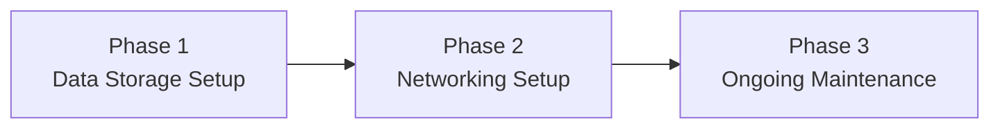

---
{"dg-publish":true,"permalink":"/1-get-started/1-2-pricing-and-timeline/"}
---

# Pricing

|             | STARTER             | PRO                 |
| ----------- | ------------------- | ------------------- |
| Setup       | $1,000 one-time fee | $2,500 one-time fee |
| Maintenance | $1,500 per year     | $5,000 per year     |
## *Starter* Tier

Give your business a **robust data storage scheme with basic remote access**. Use a real workflow rather than just what's been available to you.

## *Pro* Tier

Elevate your setup with **tailored and customizable data and networking solutions**, built to your specifications. See how your workflow can adapt to your needs, and not the other way around.

## Clear Breakdown of Services

Know exactly what to expect with us. Services provided will be explicitly noted in any signed agreements.

---
# Timeline

---

## Phase 1: Set up data storage scheme

> [!info] Essential Data Handling Solutions (*Starter* and *Pro* tiers)
> - Set up **network-attached storage device (NAS)**
> - Build **a resilient (yet effortless) backup system** using the [[x. Knowledge Base/What is a 3-2-1 backup strategy?\|3-2-1 Backup Strategy]]
> - Check out what else we can do [[x. Knowledge Base/Solution Examples\|here]]

> [!done] Custom Data Handling Solutions (*Pro* tier only)
> 
> - **Tailored Workflow Solutions** - Design systems built around your unique workflow instead of one-size-fits-all public tools.
> - **Customized File Sharing Access Control** - Fine-tune who can view, edit, or download shared files to match your exact requirements.
> - **Custom Scripts and Automation** - Build personalized scripts or automated processes based on your specific needs.
> - And more!

---
## Phase 2: Set up networking scheme

> [!info] Essential Networking Solutions (*Starter* and *Pro* tiers)
> - Configure **remote file access**
> - Check out what else we can do [[x. Knowledge Base/Solution Examples\|here]]

> [!done] Custom Networking Solutions (*Pro* tier only)
> - **Remote Access for Network Devices** - Set up secure remote access for printers, cameras, media servers, and other networked equipment.
> - **Custom Domain, Email, and Hosting Setup** - Configure your own domain name, branded email addresses, and hosting environment.
> - **Public NAS Endpoint Setup** - Make your NAS accessible via a custom public address (e.g., `nas.companyserver.com`) for smoother global many-to-one data transfers.
> - **Automated Syncing Between Computers** - Enable secure, real-time or scheduled file synchronization between two machines.
> - **WireGuard VPN Configuration** - Set up secure WireGuard tunnels for remote access without relying on Tailscale.
> - **Livestreaming Configuration** - Prepare and configure your network or server environment to handle live video streaming.
> - **Network Topology Consultation** - Advise on optimal network layout and device connections for reliability and performance.
> - **Client Delivery Optimization** - Implement hosted review portals or high-speed alternatives to FTP for faster client file delivery.
> - **Domain Connections for Existing Services** - Link your custom domain to compatible services you already use, improving branding for portals or client-facing tools.
> - And more!

---
## Phase 3: Ongoing maintenance

> [!info] Maintenance
> * Email support
> * Disk health and file integrity checks
> * Update management (firmware, OS)
> * Maintaining custom-made solutions (*Pro* tier only)

---
## Additional Services

| Service                                                                                                                                                                                      | Fee                                                                 |
| -------------------------------------------------------------------------------------------------------------------------------------------------------------------------------------------- | ------------------------------------------------------------------- |
| **Remote backup storage** - Store deduplicated, end-to-end encrypted data with version history, OR - Get access to: remote transcoding, file encryption, file restoration, and zipping | $10/TB/mo for storage  + if requested, $1/min of compute time |
| **Automated cold backups** - Let us handle your cold storage management, and know that your data is kept securely air-gapped                                                              | $30/mo + Cost of drives                                             |
| **Data recovery support** - For if you need help beyond the available docs                                                                                                                | $100/incident                                                       |
| **Docker container installation assistance** - For when you want to further customize your system yourself                                                                                | $100/configuration                                                  |
