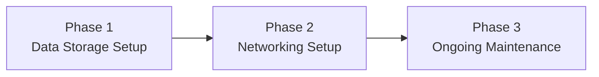

---
{"dg-publish":true,"permalink":"/2-pricing/2-1-data-and-networking-services/"}
---

# Timeline

---

## Phase 1: Set up data storage scheme

- Set up **network-attached storage device (NAS)**
- Build resilient (yet effortless) backup system using the **[[x. Knowledge Base/What is a 3-2-1 backup strategy?\|3-2-1 Backup Strategy]]**
- **Customized solutions** (Pro tier only)
- See a longer list of what's possible [[x. Knowledge Base/List of Solutions\|here]]

## Phase 2: Set up networking scheme

- Configure **remote file access**
- **Customized solutions** (Pro tier only)
- See a longer list of what's possible [[x. Knowledge Base/List of Solutions\|here]]

## Phase 3: Ongoing maintenance

- **Included:**
	* Disk health and file integrity checks
	* Update management (firmware, OS)
	* Troubleshooting (failed RAID, degraded performance)
* **Fee per occurrence:**
	* Remote recovery support
	* Assistance with Docker container installations

---
## Additional Services

* Backup destination
* **Automated syncing** to a cold archive
- Build out lighting grid system so they can control studio lighting from the ground (get a sound stage set up properly) ==I don't really like this though? Too specific, but could be lucrative==
- remote transcoding
- remote file encryption and archiving
- remotely restore lost files (if our scheme allows it)