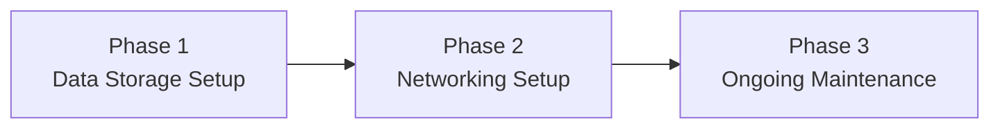

---
{"dg-publish":true,"permalink":"/2-pricing/2-1-timeline-and-pricing/"}
---

# Timeline

---

## Phase 1: Set up data storage scheme

- Set up **network-attached storage device (NAS)**
- Build resilient (yet effortless) backup system using the **[[x. Knowledge Base/What is a 3-2-1 backup strategy?\|3-2-1 Backup Strategy]]**
- **Customized solutions** (Pro tier only)
- Check out what else we can do [[x. Knowledge Base/Solution Examples\|here]]

## Phase 2: Set up networking scheme

- Configure **remote file access**
- **Customized solutions** (Pro tier only)
- Check out what else we can do [[x. Knowledge Base/Solution Examples\|here]]

## Phase 3: Ongoing maintenance

- **Included:**
	* Email support
	* Disk health and file integrity checks
	* Update management (firmware, OS)
* **Fee per occurrence:**
	* Remote recovery support
	* Assistance with Docker container installations
	* Troubleshooting (failed RAID, degraded performance)

---

# Pricing

## Primary Services

**Setup fee:**
- Starter: $500 one-time fee
- Pro: $1,500 one-time fee

**Maintenance fee:**
- Starter: $1,500/year
- Pro: $3,000/year

## Additional Services

* Backup destination
* **Automated syncing** to a cold archive
* Build out lighting grid system so they can control studio lighting from the ground (get a sound stage set up properly)
* remote transcoding
* remote file encryption and archiving
* remotely restore lost files (if our scheme allows it)