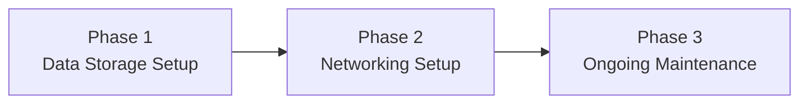

---
{"dg-publish":true,"permalink":"/2-pricing/2-1-timeline-and-pricing/"}
---

# Timeline

---

## Phase 1: Set up data storage scheme

> [!done] Standard data solutions
> - Set up **network-attached storage device (NAS)**
> - Build resilient (yet effortless) backup system using the **[[x. Knowledge Base/What is a 3-2-1 backup strategy?\|3-2-1 Backup Strategy]]**
> - Check out what else we can do [[x. Knowledge Base/Solution Examples\|here]]

> [!tip] Custom data solutions (Pro tier only)
> 
> - Solutions that are tailored to your specific workflow, and not just designed for the general public
> - “customized file sharing access control”
> - “custom scripts/automation based on client needs”
> - And more!

## Phase 2: Set up networking scheme

> [!done] Standard networking solutions
> - Configure **remote file access**
> - Check out what else we can do [[x. Knowledge Base/Solution Examples\|here]]

> [!tip] Custom networking solutions (Pro tier only)
> - “set up remote access for network devices such as printers, cameras, media servers, etc."
> - “configure custom domain, email address, and hosting”
> - “set up public endpoint for NAS to be accessible over the internet publicly, i.e. `nas.companyserver.com`, better for many-to-one data global transfers, rather than a pre-defined group of computers”
> - “automated syncing between two computers”
> - “wireguard configuration without using Tailscale”
> - configure livestreaming
> - consultation regarding network topology
> - **Client delivery optimization** (hosted review sites, fast FTP alternatives)
> - connect domains to various services you may already be using that offer support for it to enable better branding (i.e. customer portals)
> - And more!

## Phase 3: Ongoing maintenance

- **Included:**
	* Email support
	* Disk health and file integrity checks
	* Update management (firmware, OS)
* **Fee per occurrence:**
	* Remote recovery support
	* Assistance with Docker container installations
	* Troubleshooting (failed RAID, degraded performance)

---

# Pricing

## Primary Services

**Setup fee:**
- Starter: $500 one-time fee
- Pro: $1,500 one-time fee

**Maintenance fee:**
- Starter: $1,500/year
- Pro: $3,000/year

## Additional Services

* Backup destination
* **Automated syncing** to a cold archive
* Build out lighting grid system so they can control studio lighting from the ground (get a sound stage set up properly)
* remote transcoding
* remote file encryption and archiving
* remotely restore lost files (if our scheme allows it)